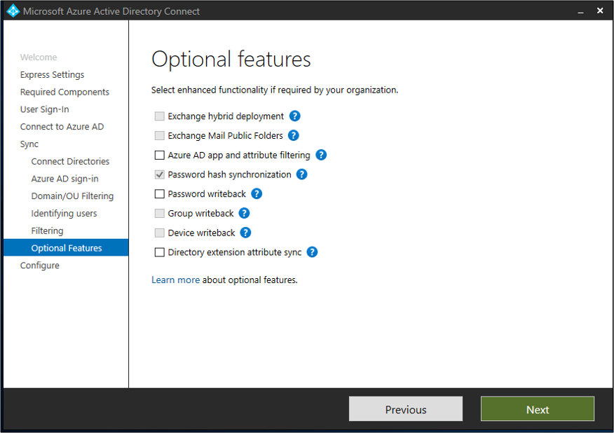
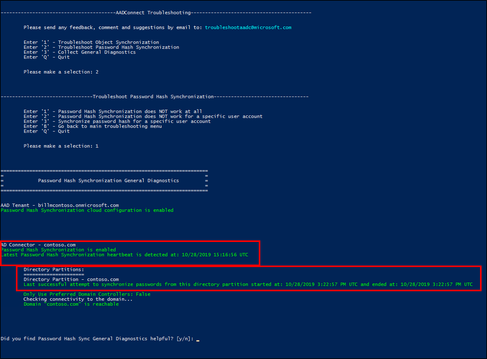
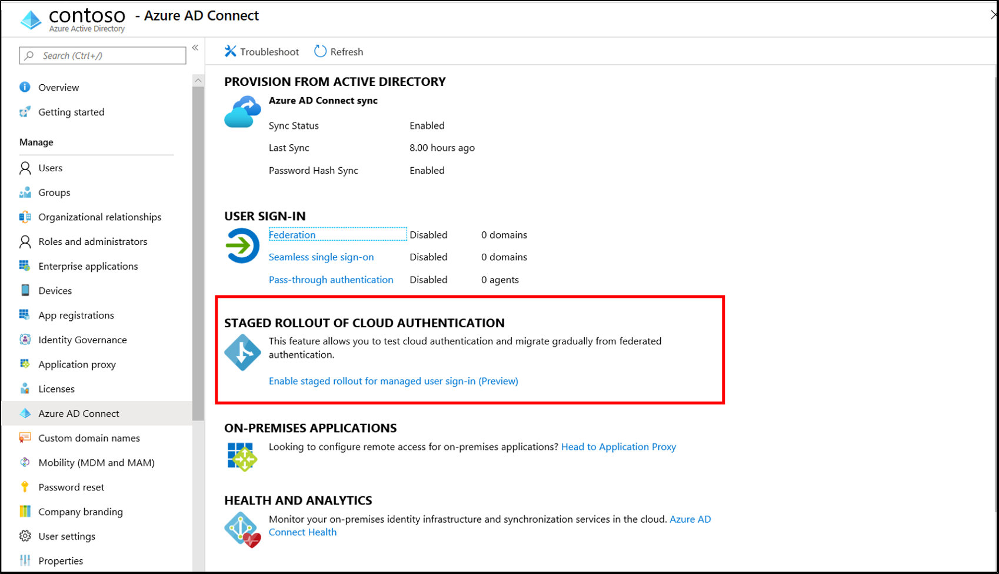
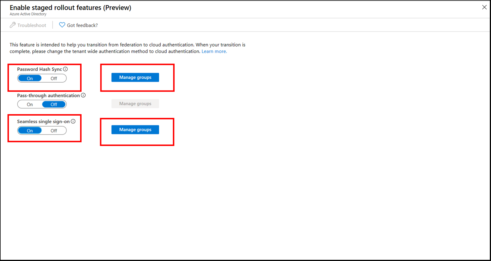
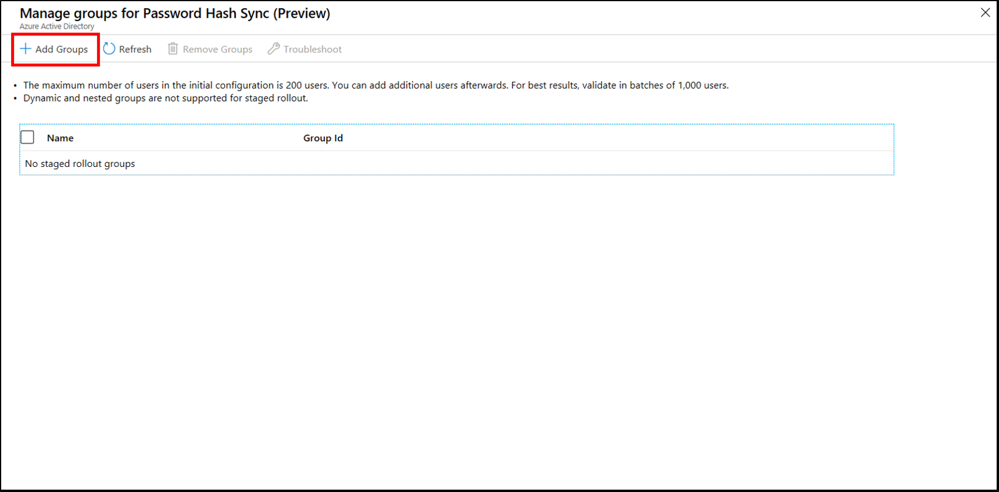
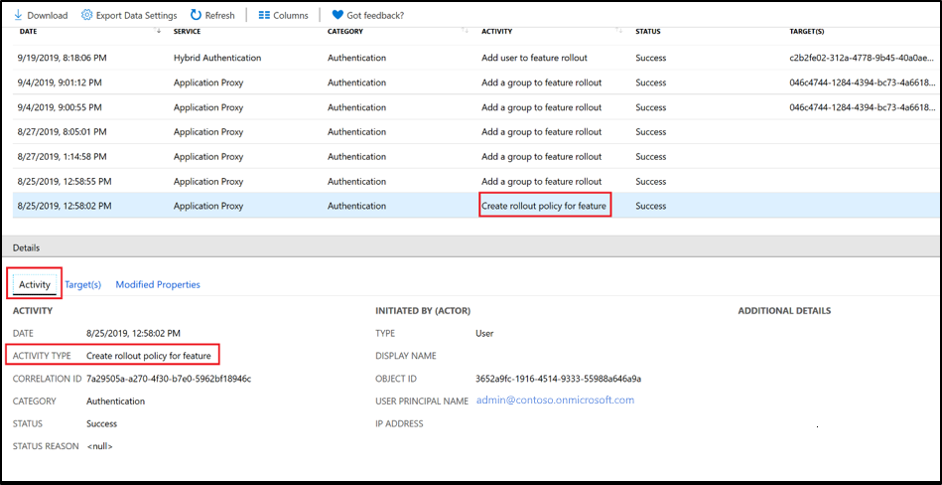
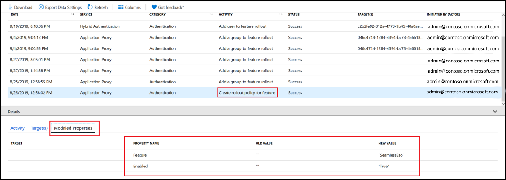
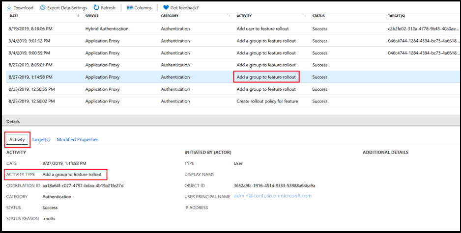
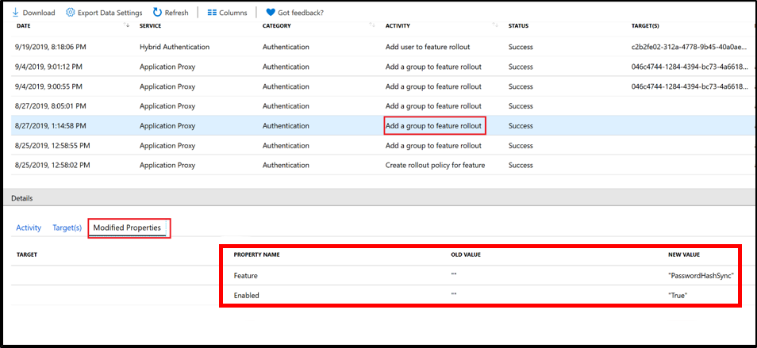

# Cloud authentication: Staged rollout (Public Preview)

This feature allows you to migrate from federated authentication to cloud authentication by using a staged approach.

Moving away from federated authentication has implications. For example, if you have any of the following:
	
-  an on-premises MFA server 
-  are using smart cards for authentication 
-  other federation only features

These features should be taken into consideration prior to switching to cloud authentication.  Before trying this feature, we suggest you review our guide on choosing the right authentication method. See [this table](https://docs.microsoft.com/azure/security/fundamentals/choose-ad-authn#comparing-methods) for more details.

>[!VIDEO https://www.microsoft.com/videoplayer/embed/RE3inQJ]

## Prerequisites

-   You have an Azure AD tenant with federated domains.

-   You have decided to move to either Password Hash Sync + Seamless SSO **(Option A),** or Pass-through Authentication + Seamless SSO **(Option B).** Although seamless SSO is optional, we recommend enabling seamless SSO to achieve a silent sign-in experience for users using domain joined machines from inside corporate network.

-   You have configured all the appropriate tenant branding and Conditional Access policies you need for users who are being migrated over to cloud authentication.

-   If you plan to use Azure Multi-Factor Authentication, we recommend you use [converged registration for Self-service Password Reset (SSPR) and Azure MFA](../authentication/concept-registration-mfa-sspr-combined.md) to get your users to register their authentication methods once.

-   To use this feature, you need to be Global Administrator on your tenant.

-   To enable Seamless SSO on a specific AD forest, you need to be Domain Administrator.

## Supported scenarios

These scenarios are supported for staged rollout:

- This feature works only for users provisioned to Azure AD using Azure AD Connect and is not applicable for cloud-only users.

- This feature works only for user sign-in traffic on browsers and modern authentication clients. Applications or Cloud services using legacy authentication will fall back to federated authentication flows. (Example: Exchange online with Modern Authentication turned off, or Outlook 2010, which does not support Modern Authentication.)

## Unsupported Scenarios

These scenarios are not supported for staged rollout:

- Certain applications send the "domain\_hint" query parameter to Azure AD during authentication. These flows will continue and users enabled for staged rollout will continue to use federation for authentication.

<!-- -->

- Admin can roll out cloud authentication using security groups. (Cloud Security groups are recommended to avoid sync latency when using on-premises AD security groups.)

    - You can use a **maximum of 10 groups per feature**; i.e., for each of Password Hash Sync / Pass-through Authentication / Seamless SSO.

    - Nested groups are **not supported**. This is the scope for public preview as well.

    - Dynamic groups are **not supported** for staged rollout.

    - Contact Objects inside the group will block the group form being added.

- The final cutover from federated to cloud authentication still needs to happen using Azure AD Connect or PowerShell. This feature doesn't switch domains from federate to managed.

- When you first add a security group for staged rollout, it is limited to 200 users to avoid the UX from timing out. Once the group is added in the UX, you can add more users directly to the group as required.

## Get started with staged rollout

If you want to test Password Hash Sync (PHS) sign-in using staged rollout, please complete the below pre-work to enable Password Hash Sync staged rollout.

For more information on the PowerShell cmdlets used, see [AzureAD 2.0 preview](https://docs.microsoft.com/powershell/module/azuread/?view=azureadps-2.0-preview#staged_rollout)

## Pre-work for Password Hash Sync

1. Enable Password Hash Sync from the [Optional features](how-to-connect-install-custom.md#optional-features) page in Azure AD Connect. 

   

1. Ensure that a full Password Hash Sync cycle has run through so that all the users' password hashes have been synchronized to Azure AD. You can use the PowerShell diagnostics [here](tshoot-connect-password-hash-synchronization.md) to check the status of Password Hash Sync.

   

If you want to test Pass through-authentication (PTA) Sign-in using staged rollout, please complete the below pre-work to enable PTA for staged rollout.

## Pre-work for Pass-through Authentication

1. Identify a server running Windows Server 2012 R2 or later where you want the Pass through Authentication Agent to run (**DO NOT choose the Azure AD Connect server**). Ensure that the server is domain-joined, can authenticate selected users with Active Directory, and can communicate with Azure AD on outbound ports / URLs (see detailed [prerequisites](how-to-connect-sso-quick-start.md)).

1. [Download](https://aka.ms/getauthagent) & install the Microsoft Azure AD Connect Authentication Agent on the server. 

1. To enable [high availability](how-to-connect-sso-quick-start.md), install additional Authentication Agents on other servers.

1. Ensure that you have configured your [Smart Lockout settings](../authentication/howto-password-smart-lockout.md) appropriately. This is to ensure that your users' on-premises Active Directory accounts don't get locked out by bad actors.

We recommend enabling Seamless SSO irrespective of the sign-in method ( PHS or PTA ) you select for staged rollout. Please complete the below pre-work to enable Seamless SSO for staged rollout.

## Pre-work for Seamless SSO

Enable Seamless SSO on the AD forests using PowerShell. If you have more than one AD Forest, please enable the same for each forest individually. Seamless SSO will only be triggered for users selected for staged rollout and won't impact your existing federation setup.

**Summary of the steps**

1. First, log in to Azure AD Connect Server.

2. Navigate to the %programfiles%\\Microsoft Azure Active Directory Connect folder.

3. Import the Seamless SSO PowerShell module using this command: `Import-Module .\\AzureADSSO.psd1`.

4. Run PowerShell as an Administrator. In PowerShell, call `New-AzureADSSOAuthenticationContext`. This command should give you a dialog box where you can enter your tenant's Global Administrator credentials.

5. Call `Get-AzureADSSOStatus \| ConvertFrom-Json`. This command provides you the list of AD forests (look at the \"Domains\" list) on which this feature has been enabled. By default, it is set to false at the tenant level.

   > **Example:**
   > 

6. Call `\$creds = Get-Credential`. When prompted, enter the Domain Administrator credentials for the intended AD forest.

7. Call `Enable-AzureADSSOForest -OnPremCredentials \$creds`. This command creates the AZUREADSSOACC computer account from the on-premises domain controller for this specific Active Directory forest that is required for Seamless SSO.

8. Seamless SSO requires URLs to be in the intranet zone. Please refer to the [seamless single sign-on quickstart](how-to-connect-sso-quick-start.md#step-3-roll-out-the-feature) to deploy those URL's using Group Policies.

9.  You could also download our [deployment plans](https://aka.ms/SeamlessSSODPDownload) for Seamless SSO for a complete walkthrough.

## Enable staged rollout

Use the following steps to roll out a specific feature (Pass-through Authentication / Password Hash Sync / Seamless SSO) to a select set of users in a group:

### Enable the staged rollout of a specific feature on your tenant

You can roll out one of these options

-   Password Hash Sync + Seamless SSO **(Option A)**

-   Pass-through Authentication + Seamless SSO **(Option B)**

-   Password Hash Sync + Pass-through Authentication + Seamless SSO **-\>** ***Not Supported***

Complete these steps:

1. Log in to the Azure AD Portal using the below URL to access the Preview UX.

   > <https://aka.ms/stagedrolloutux>

2. Click on Enable staged rollout for managed user sign-in (preview)

   *For Example:* (**OPTION B**) If you wish to enable Password Hash Sync and Seamless SSO, please slide the Password Hash Sync and Seamless single sign-on features to **'ON'** as shown below.

   

   

3. Add the respective groups to the feature to enable Pass-through Authentication and Seamless single sign-on. Please ensure the security groups have no more than 200 members initially to avoid UX time-out.

   

   >[!NOTE]
   >The members in a group are automatically enabled for staged rollout. Nested and Dynamic groups are not supported for staged rollout.

## Auditing

We have enabled audit events for the different actions we perform for staged rollout.

- Audit event when you enable Staged Rollout for Password Hash Sync / Pass-through Authentication / Seamless SSO.

  >[!NOTE]
  >Audit event that is logged when SeamlessSSO is turned **ON** using StagedRollout.

  

  

- Audit event when a group is added to Password Hash Sync / Pass-through Authentication / Seamless SSO.

  >[!NOTE]
  >Audit event logged when a group is added to Password Hash Sync for staged rollout

  

  

- Audit event when a user who was added to the group is enabled for staged rollout

  

  

## Validation

To test sign-in with Password Hash Sync or Pass-through Authentication (username / password sign-in):

1. Browse to <https://myapps.microsoft.com> on a private browser session from extranet and enter the UserPrincipalName (UPN) of the user account selected for staged roll out.

1. If user has been targeted for staged rollout, the user will not be redirected to your federated login page and instead will be asked to sign in on the Azure AD tenant-branded sign-in page.

1. Ensure that the sign-in successfully appears in the [Azure AD sign-in activity report](../reports-monitoring/concept-sign-ins.md) by filtering with the UserPrincipalName..

To test sign-in with Seamless SSO:

1. Browse to <https://myapps.microsoft.com>/ on a private browser session from intranet and enter the UserPrincipalName (UPN) of the user account selected for staged roll out.

1. If the user has been targeted for staged rollout of Seamless SSO, the user will see a "Trying to sign you in ..." message before being silently signed in.

1. Ensure that the sign-in successfully appears in the [Azure AD sign-in activity report](../reports-monitoring/concept-sign-ins.md) by filtering with the UserPrincipalName.

To check user sign-ins still happening on federation providers:

Here is how you can track user sign-ins still happening on AD FS for selected staged rollout users using [these instructions](https://docs.microsoft.com/windows-server/identity/ad-fs/troubleshooting/ad-fs-tshoot-logging#types-of-events). Check vendor documentation on how to check this on 3rd party federation providers.

## Roll back

### Remove a user from staged rollout

1.  Removing the user from the group disables staged rollout for the user.

2.  If you wish to disable staged rollout feature, please slide the feature back to **'OFF'** state to turn off staged rollout.

## Frequently asked questions

-   **Q: Can a customer use this capability in production?**

-   A: Yes, this feature can be used in your production tenant, but we recommend that you first try this capability out in your test tenant.

-   **Q: Can this feature be used to maintain a permanent "co-existence" where some users use federated authentication, and others cloud authentication?**

-   A: No, this feature is designed for migrating from federated to cloud authentication in stages and then to eventually cut over to Cloud authentication. We do not recommend a permanent mixed state as this could lead to unexpected authentication flows.

-   **Q: Can we use PowerShell to perform staged rollout?**

-   A: Yes, Please find the documentation to use PowerShell to perform staged rollout here.

## Next Steps
- [AzureAD 2.0 preview](https://docs.microsoft.com/powershell/module/azuread/?view=azureadps-2.0-preview#staged_rollout )
