# Take a tour of the Azure IoT Central UI (preview features)

[!INCLUDE [iot-central-pnp-original](../../../includes/iot-central-pnp-original-note.md)]

This article introduces you to the Microsoft Azure IoT Central UI. You can use the UI to create, manage, and use an Azure IoT Central solution and its connected devices.

As a _solution builder_, you use the Azure IoT Central UI to define your Azure IoT Central solution. You can use the UI to:

* Define the types of device that connect to your solution.
* Configure the rules and actions for your devices. 
* Customize the UI for an _operator_ who uses your solution.

As an _operator_, you use the Azure IoT Central UI to manage your Azure IoT Central solution. You can use the UI to:

* Monitor your devices.
* Configure your devices.
* Troubleshoot and remediate issues with your devices.
* Provision new devices.

## IoT Central homepage

The [IoT Central homepage](https://aka.ms/iotcentral-get-started) page is the place where you can learn more about the latest news and features available on IoT Central, create new applications, and see and launch your existing application.

> [!div class="mx-imgBorder"]
> 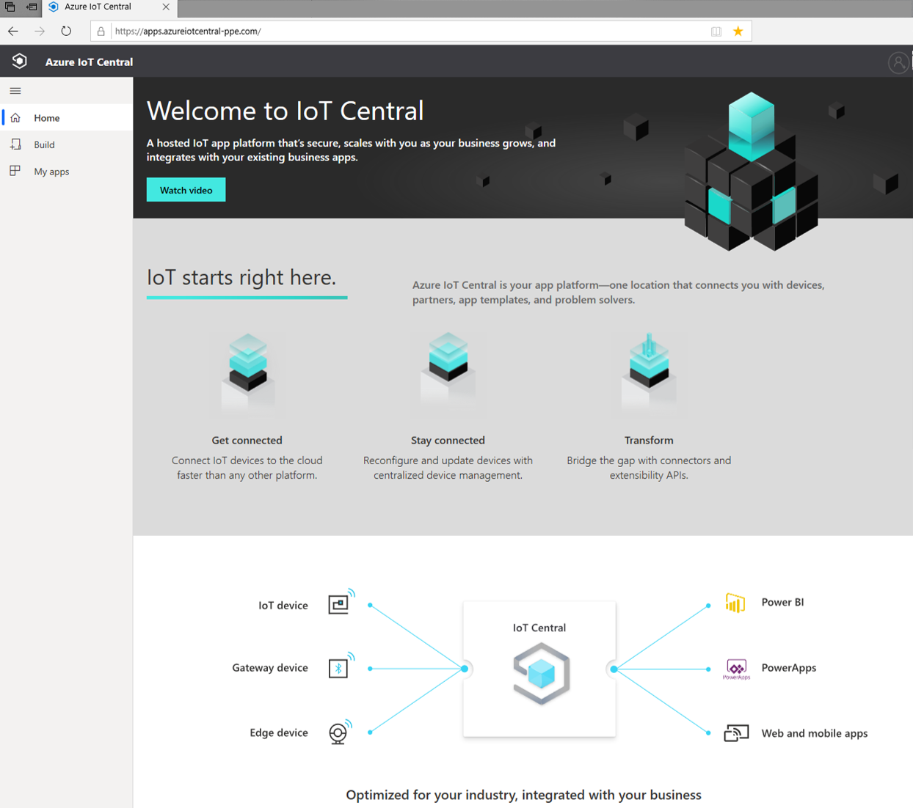

### Create an application

In the Build section you can browse the list of industry-relevant IoT Central templates to help you get started quickly, or start from scratch using a Custom app template.  
> [!div class="mx-imgBorder"]
> 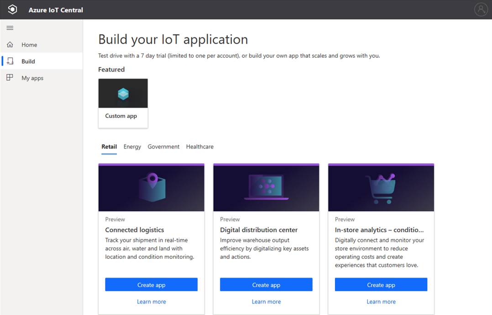

To learn more, see the [Create an Azure IoT Central application](quick-deploy-iot-central-pnp.md?toc=/azure/iot-central-pnp/toc.json&bc=/azure/iot-central-pnp/breadcrumb/toc.json) quickstart.

### Launch your application

You can launch your IoT Central application by going to the URL that you or your solution builder choose during app creation. You can also see a list of all the applications you have access to in the [IoT Central app manager](https://aka.ms/iotcentral-apps).

> [!div class="mx-imgBorder"]
> 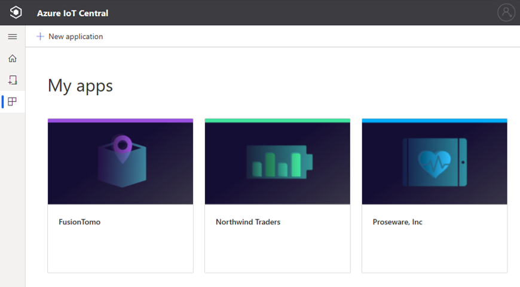

## Navigate your application

Once you're inside your IoT application, use the left pane to access the different areas. You can expand or collapse the navigation bar by selecting the three-lined icon on top of the navigation bar:

> [!NOTE]
> The items you see on the navigation bar will depend on your user role. Learn more about [managing users and roles](howto-manage-users-roles-pnp.md?toc=/azure/iot-central-pnp/toc.json&bc=/azure/iot-central-pnp/breadcrumb/toc.json). 

:::row:::
  :::column span="":::
      > [!div class="mx-imgBorder"]
      > 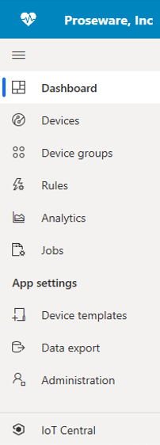
  :::column-end:::
  :::column span="2":::
     **Dashboard** displays your application dashboard. As a *solution builder*, you can customize the global dashboard for your operators. Depending on their user role, operators can also create their own personal dashboards.
     
     **Devices** enables you to manage your connected devices - real and simulated.

     **Device groups** lets you view and create logical collections of devices specified by a query. You can save this query and use device groups through the application to perform bulk operations.

     **Rules** enables you to create and edit rules to monitor your devices. Rules are evaluated based on device telemetry and trigger customizable actions.

     **Analytics** lets you create custom views on top of device data to derive insights from your application.

     **Jobs** enables you to manage your devices at scale by running bulk operations.

     **Device templates** is where you create and manage the characteristics of the devices that connect to your application.

     **Data export** enables you to configure a continuous export to external services - such as storage and queues.

     **Administration** is where you can manage your application's settings, customization, billing, users, and roles.

     **IoT Central** lets *administrators* to jump back to IoT Central's app manager.
     
   :::column-end:::
:::row-end:::

### Search, help, theme, and support

The top menu appears on every page:

> [!div class="mx-imgBorder"]
> 

* To search for device templates and devices, enter a **Search** value.
* To change the UI language or theme, choose the **Settings** icon. Learn more about [managing your application preferences](howto-manage-preferences.md?toc=/azure/iot-central-pnp/toc.json&bc=/azure/iot-central-pnp/breadcrumb/toc.json)
* To sign out of the application, choose the **Account** icon.
* To get help and support, choose the **Help** drop-down for a list of resources. In a trial application, the support resources include access to [live chat](howto-show-hide-chat.md?toc=/azure/iot-central-pnp/toc.json&bc=/azure/iot-central-pnp/breadcrumb/toc.json).

You can choose between a light theme or a dark theme for the UI:

> [!NOTE]
> The option to choose between light and dark themes isn't available if your administrator has configured a custom theme for the application.

> [!div class="mx-imgBorder"]
> 

### Dashboard
> [!div class="mx-imgBorder"]
> 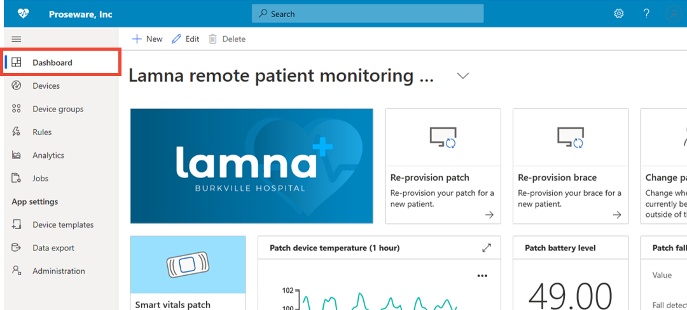

* The dashboard is the first page you see when you sign in to your Azure IoT Central application. As a *solution builder*, you can create and customize multiple global application dashboards for other users. Learn more about [adding tiles to your dashboard](howto-add-tiles-to-your-dashboard.md?toc=/azure/iot-central-pnp/toc.json&bc=/azure/iot-central-pnp/breadcrumb/toc.json)

* As an *operator*, if your user role allows it, you can create personal dashboards to monitor what you care about. To learn more, see the [Create Azure IoT Central personal dashboards](howto-create-personal-dashboards.md?toc=/azure/iot-central-pnp/toc.json&bc=/azure/iot-central-pnp/breadcrumb/toc.json) how-to article.

### Devices

> [!div class="mx-imgBorder"]
> 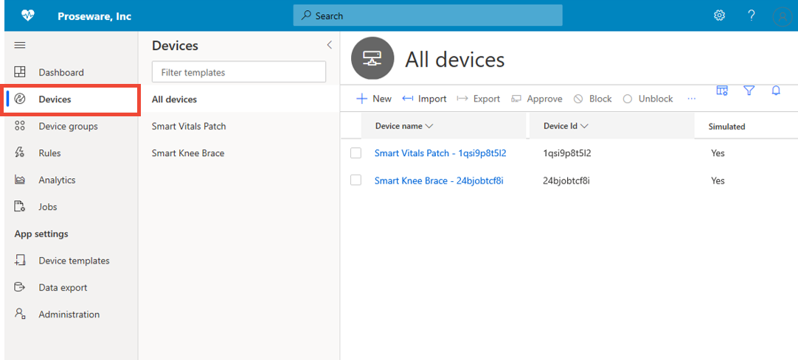

The explorer page shows the _devices_ in your Azure IoT Central application grouped by _device template_. 

* A device template defines a type of device that can connect to your application.
* A device represents either a real or simulated device in your application.

To learn more, see the [Monitor your devices](tutorial-monitor-devices.md?toc=/azure/iot-central-pnp/toc.json&bc=/azure/iot-central-pnp/breadcrumb/toc.json) tutorial. 

### Device groups

> [!div class="mx-imgBorder"]
> 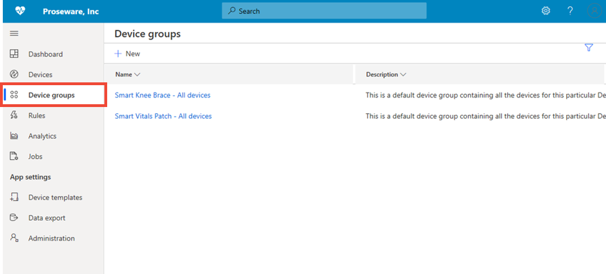

Device group are a collection of related devices. A *solution builder* defines a query to identify the devices that are included in a device group. You use device groups to perform bulk operations in your application. To learn more, see the [Use device groups in your Azure IoT Central application](tutorial-use-device-groups-pnp.md?toc=/azure/iot-central-pnp/toc.json&bc=/azure/iot-central-pnp/breadcrumb/toc.json) article.

### Rules
> [!div class="mx-imgBorder"]
> 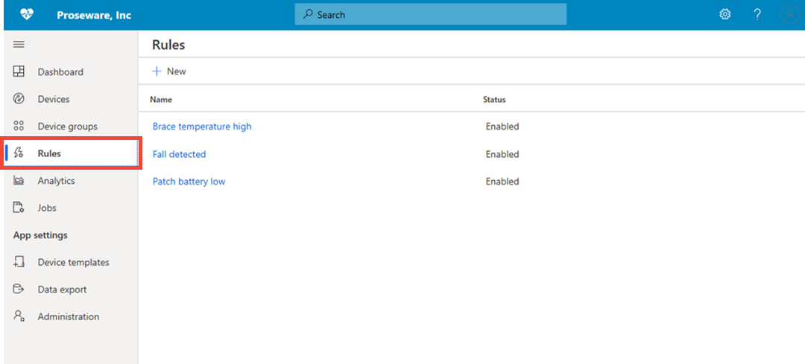

The rules page lets you define rules based on devices' telemetry, state, or events. When a rule fires, it can trigger one or more actions - such as sending an email, notify an external system via webhook alerts, etc. To learn, see the [Configuring rules](tutorial-create-telemetry-rules-pnp.md?toc=/azure/iot-central-pnp/toc.json&bc=/azure/iot-central-pnp/breadcrumb/toc.json) tutorial. 

### Analytics

> [!div class="mx-imgBorder"]
> 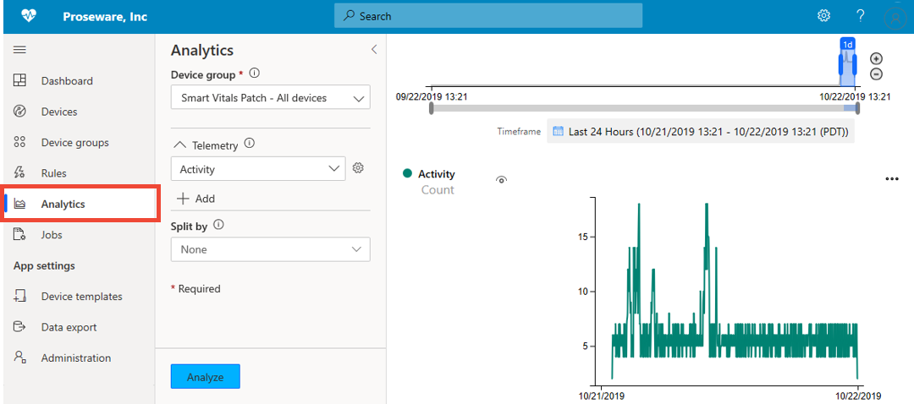

The analytics lets you create custom views on top of device data to derive insights from your application. To learn more, see the [Create analytics for your Azure IoT Central application](howto-create-analytics-pnp.md?toc=/azure/iot-central-pnp/toc.json&bc=/azure/iot-central-pnp/breadcrumb/toc.json) article.

### Jobs

> [!div class="mx-imgBorder"]
> 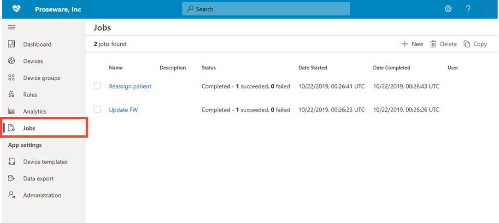

The jobs page lets you run bulk device management operations on your devices. You can update device properties, settings, and execute commands against device groups. To learn more, see the [Run a job](howto-run-a-job.md?toc=/azure/iot-central-pnp/toc.json&bc=/azure/iot-central-pnp/breadcrumb/toc.json) article.

### Device templates

> [!div class="mx-imgBorder"]
> 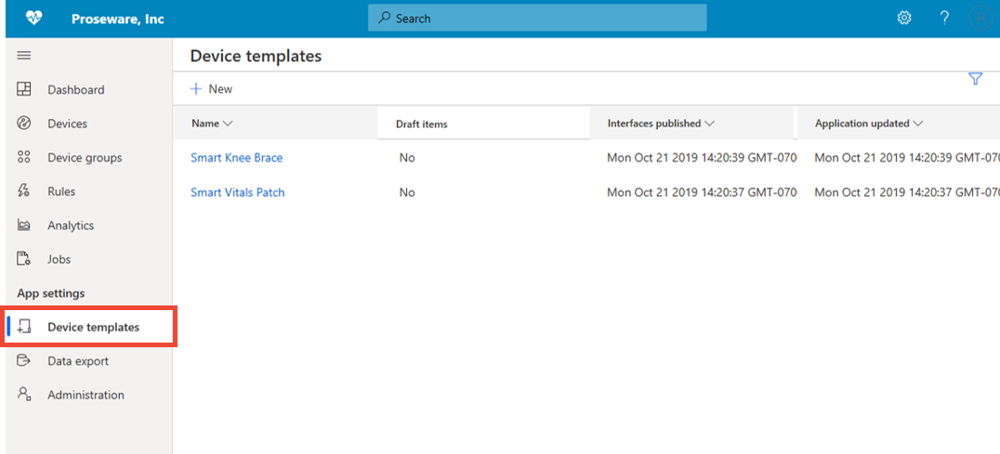

The device templates page is where a builder creates and manages the device templates in the application. A device template specifies devices characteristics such as:

* Telemetry, state, and event measurements
* Properties
* Commands
* Views

The *solution builder* can also create forms and dashboards for operators to use to manage devices.

To learn more, see the [Define a new device type in your Azure IoT Central application](howto-set-up-template-pnp.md?toc=/azure/iot-central-pnp/toc.json&bc=/azure/iot-central-pnp/breadcrumb/toc.json) tutorial. 

### Data export
> [!div class="mx-imgBorder"]
> 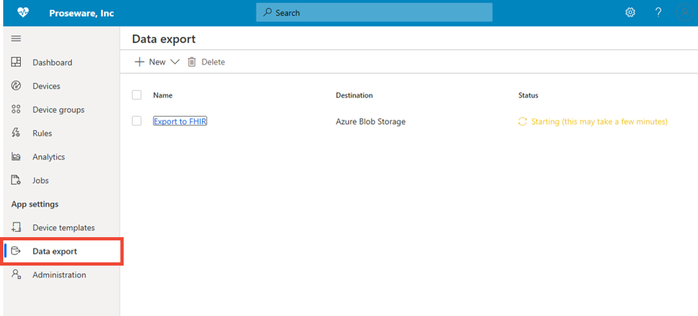

Data export enables you to set up streams of data, such as telemetry, from the application to external systems. To learn more, see the [Export your data in Azure IoT Central](howto-export-data-blob-storage.md?toc=/azure/iot-central-pnp/toc.json&bc=/azure/iot-central-pnp/breadcrumb/toc.json) article.

### Administration
> [!div class="mx-imgBorder"]
> 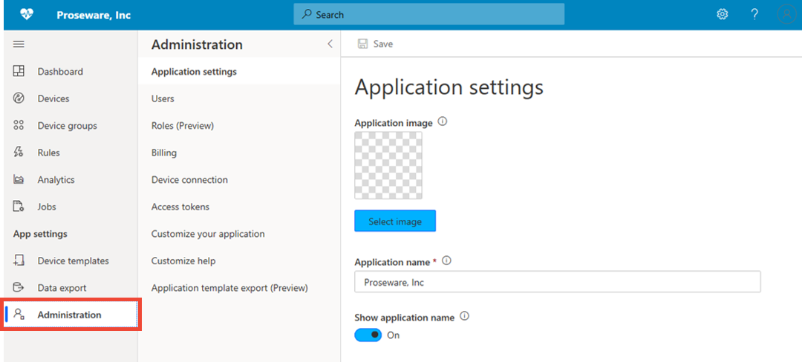

The administration page allows you to configure and customize your IoT Central application. Here you can change your application name, URL, theming, manage users and roles, create API tokens, and export your application. To learn more, see the [Administer your Azure IoT Central application](howto-administer-pnp.md?toc=/azure/iot-central-pnp/toc.json&bc=/azure/iot-central-pnp/breadcrumb/toc.json) article.

## Next steps

Now that you have an overview of Azure IoT Central and are familiar with the layout of the UI, the suggested next step is to complete the [Create an Azure IoT Central application](quick-deploy-iot-central-pnp.md?toc=/azure/iot-central-pnp/toc.json&bc=/azure/iot-central-pnp/breadcrumb/toc.json) quickstart.
